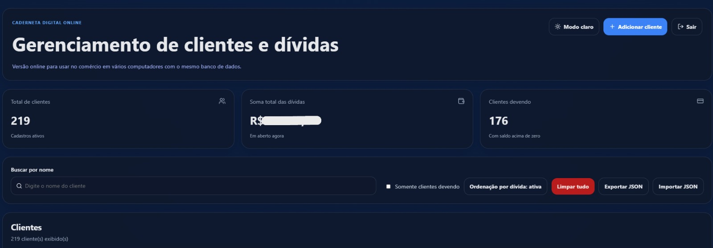
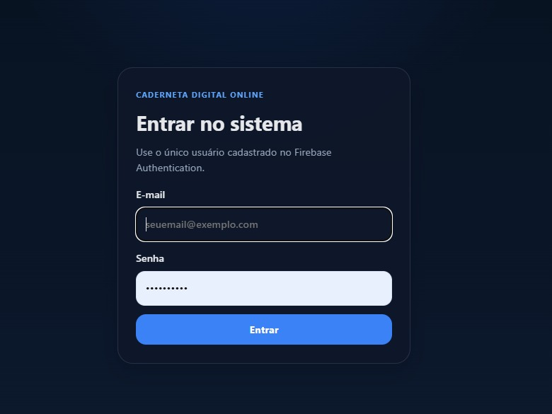

# Sistema de Controle de Clientes e Dívidas

Aplicação web desenvolvida para gerenciar clientes, dívidas e pagamentos de um pequeno comércio familiar.

## Sobre o projeto

Este sistema foi criado com o objetivo de substituir o controle manual feito em caderno, trazendo mais organização, praticidade e segurança para o gerenciamento das informações dos clientes.

Além de servir como projeto de aprendizado, a aplicação também foi colocada em uso real no dia a dia do comércio.

## Funcionalidades

- cadastro de clientes
- edição e exclusão de clientes
- registro de dívidas e pagamentos
- cálculo automático dos valores
- busca de clientes
- organização prática das informações
- backup dos dados

## Tecnologias utilizadas

- React
- TypeScript
- Firebase
- HTML
- CSS
- Git/GitHub

## Diferenciais do projeto

- desenvolvido para resolver um problema real
- aplicado em um comércio familiar
- utilizado com clientes e valores reais
- foco em usabilidade e organização prática

## Como executar o projeto

```bash
npm install
npm run dev
```

## Imagens do projeto

### Tela principal


### Tela de login


### Adicionar clientes


### Histórico de clientes

